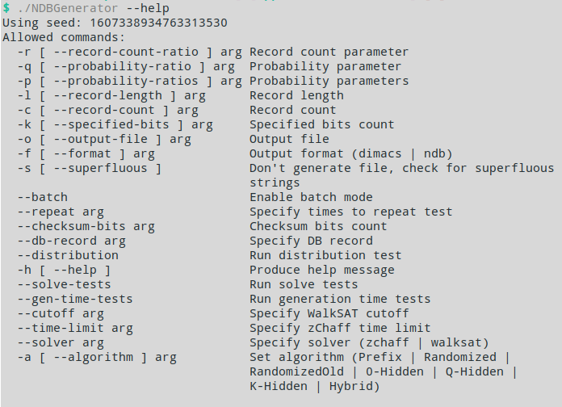

# Negative Database ([NDB](https://en.wikipedia.org/wiki/Negative_database)) authentication system

This repository contains a NDB generation and testing framework and a sample authentication application using NDB to store hashed passwords. This work was made as a part of my Engineering (BSc) Thesis which is available [here](https://github.com/GrzegorzNieuzyla/NDB-authentication-thesis/blob/master/Thesis.pdf) (only in Polish).

- [Negative Database (NDB) authentication system](#negative-database-ndb-authentication-system)
  - [NDB summary](#ndb-summary)
  - [NDB framework](#ndb-framework)
  - [Authentication system](#authentication-system)

## NDB summary

In short an NDB is a database that instead of storing records (records being const-width bit arrays) in direct way, it stores **everything but the contained records**. And since it is not plausible to store every non-record separately, it is expressed as a set of **NDB records** which consist either
of `0` or `1` on given position or `*` which indicate both literals. This form is basically a SAT formula with up to `n` variables for n-width records.

Example:

|Negative Record|SAT formula     |
|:-------------:|:--------------:|
|`011*`         |`~x1 ^ x2 ^  x3`|
|`001*`         |`~x1 ^ ~x2 ^ x3`|
|`1*1*`         |`x1 ^ x3`       |
|`0*0*`         |`~x1 ^ ~x3`     |
|`1*00`         |`x1 ^ ~x3 ^ ~x4`|

Where `xn` denotes bit on `n`th position.

This example NDB hides actual records `1001` and `1101` because only those two do not match any negative records. 

With this database checking whether a record is hidden is fast (O(record count))
but finding any record without knowing it beforehand needs exponential time (in best case scenario, it may be faster if using suboptimal NDB generator).

## NDB framework

The NDB framework (buildable from CMake) allows for generation of NDBs using one of the different algorithms, for generation benchmarking and for trying 
to find hidden records with a SAT solver (zchaff or WalkSAT).

The parameters depend on particular algorithm choice, for detailed 
explanation see my thesis or the sources below:

- Fernando Esponda. "Negative Representations of Information". PhD thesis. 2005.
- F. Esponda, S. Forrest and P. Helman. "Enhancing Privacy through Negative Representations of Data". 2004.
- Haixia Jia, Cristopher Moore and Doug Strain. "Generating Hard Satisfiable Formulas by Hiding Solutions Deceptively". Journal of Artificial Intelligence Research - JAIR 28 (march. 2005). DOI: 10.1613/ jair.2039.
- Dimitris Achlioptas, Haixia Jia and Cristopher Moore. "Hiding Satisfying Assignments: Two are Better than One". Proceedings of the National Conference on Artificial Intelligence 24 (april 2005). DOI: 10.1613/ jair.1681.
- Fernando Esponda et al. "Protecting Data Privacy Through Hard-to-Reverse Negative Da- tabases". Information Security. Red. Sokratis K. Katsikas et al. Berlin, Heidelberg: Springer Berlin Heidelberg, 2006. ISBN: 978-3-540-38343-7.
- D. Zhao et al. "A fine-grained algorithm for generating hard-toreverse negative databases". 2015 International Workshop on Artificial Immune Systems (AIS). 2015, p. 1–8. DOI: 10.1109/ AISW.2015.7469244.
- R. Liu, W. Luo and L. Yue. "The p-hidden algorithm: Hiding single databases more deeply". Immune Computation 2 (jan. 2014), p. 43–55.
- R. Liu, W. Luo and X. Wang. "A Hybrid of the prefix algorithm and the q-hidden algorithm for generating single negative databases". 2011 IEEE Symposium on Computational Intelligence in Cyber Security (CICS). 2011, p. 31–38. DOI: 10 . 1109 / CICYBS . 2011 . 5949400.

## Authentication system

Based on testing with the framework above, the K-Hidden algorithm was chosen as it showed the greatest resistance against SAT solver attacks (time to derive actual hidden records was exponential of record length).

The sample system is password-based, it derives a key using PBKDF2 and then it is encrypted as a NDB with a single actual record.

The sample application (which only contains authentication to a mock system)
is a Qt program and can be build using QtCreator and the `AuthenticationSystem.pro` project file.

### External libraries
The following SAT solvers were used for testing resulting NDBs:
- [zChaff](https://www.princeton.edu/~chaff/zchaff.html) by Princeton University
- [WalkSAT](https://www.cs.rochester.edu/u/kautz/walksat/) by Henry Kautz and Bart Selman
